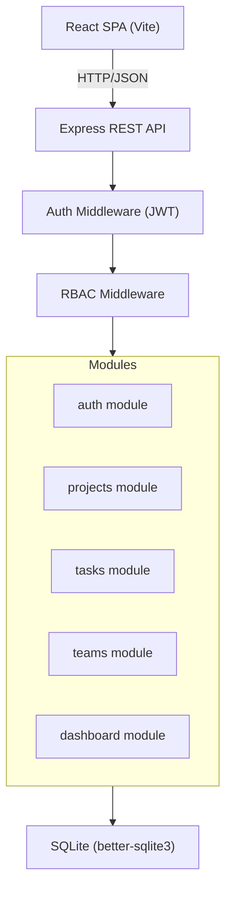
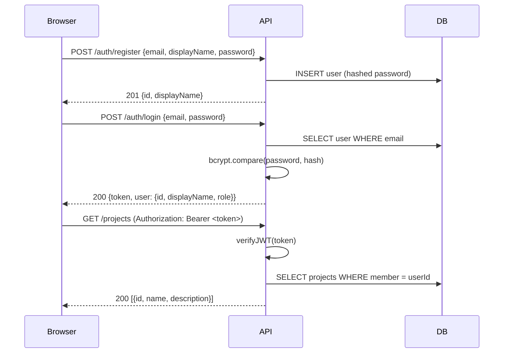
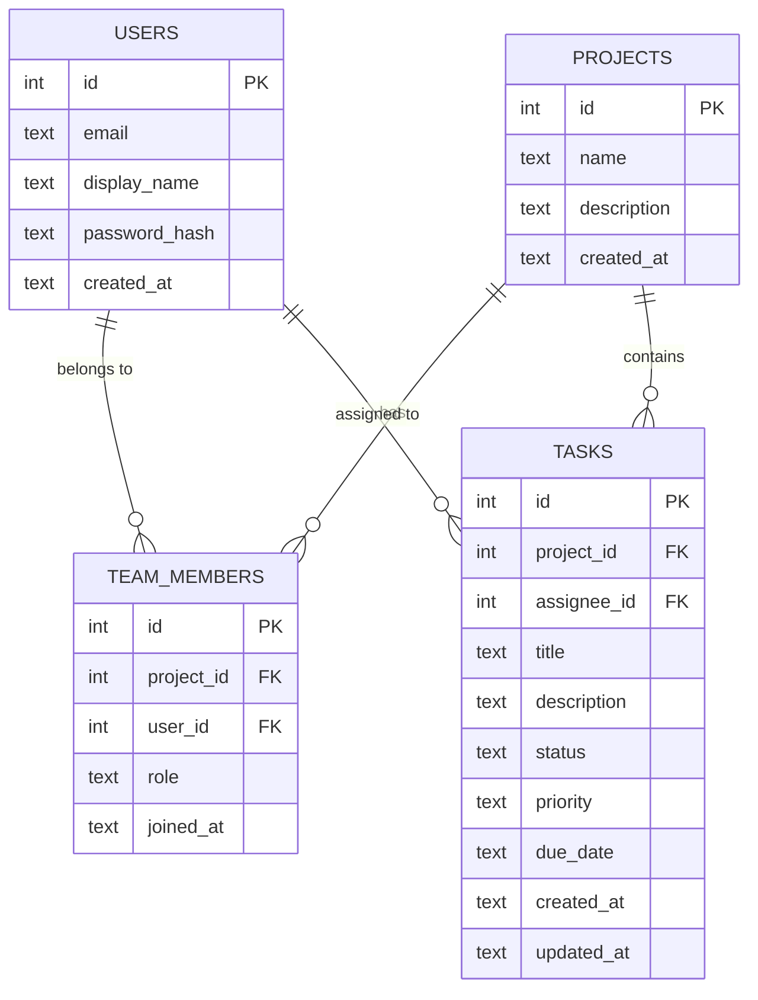

# Design Document: Team Task Manager

## Overview

The Team Task Manager is a full-stack web application that lets teams collaborate on projects by creating tasks, assigning work to members, and tracking progress. The system is built around a Node.js/Express REST API backed by SQLite, with a React (Vite) single-page application as the frontend. Authentication is JWT-based, and access control is enforced through a role-based system (Admin vs. Member) scoped to each project.

### Key Design Goals

- **Modular backend**: Each domain (auth, projects, tasks, teams, dashboard) lives in its own module with a clean interface boundary.
- **Project-scoped RBAC**: Roles are per-project, not global — a user can be an Admin on one project and a Member on another.
- **Consistent API contract**: All responses follow a uniform JSON shape; errors always include an `error` field.
- **Minimal dependencies**: SQLite with `better-sqlite3` keeps the stack simple and self-contained.

---

## Architecture

### High-Level Architecture



### Backend Module Structure

```
backend/
├── server.js              # Entry point — loads env, mounts router, starts server
├── db.js                  # SQLite connection singleton + schema initialisation
├── router.js              # Top-level router — mounts all module routers
├── middleware/
│   ├── auth.js            # JWT validation middleware
│   ├── rbac.js            # Project-scoped role enforcement middleware
│   └── validate.js        # Generic request validation helpers
└── modules/
    ├── auth/
    │   ├── auth.routes.js
    │   ├── auth.service.js
    │   └── auth.validators.js
    ├── projects/
    │   ├── projects.routes.js
    │   ├── projects.service.js
    │   └── projects.validators.js
    ├── tasks/
    │   ├── tasks.routes.js
    │   ├── tasks.service.js
    │   └── tasks.validators.js
    ├── teams/
    │   ├── teams.routes.js
    │   ├── teams.service.js
    │   └── teams.validators.js
    └── dashboard/
        ├── dashboard.routes.js
        └── dashboard.service.js
```

Each module exposes only its router and service interface. No module imports from another module's internal files — cross-module data access goes through the service layer or directly to `db.js`.

### Frontend Structure

```
frontend/src/
├── main.jsx
├── App.jsx                # Route definitions, auth guard
├── services/
│   ├── api.js             # Axios instance with JWT interceptor
│   ├── auth.js            # Login, register, token storage
│   ├── projects.js        # Project CRUD calls
│   ├── tasks.js           # Task CRUD + filter calls
│   ├── teams.js           # Team member management calls
│   └── dashboard.js       # Dashboard data calls
├── context/
│   └── AuthContext.jsx    # Global auth state (user, token, role)
├── components/
│   ├── Layout.jsx         # Shell with nav sidebar/header
│   ├── ProtectedRoute.jsx # Redirects unauthenticated users
│   ├── TaskCard.jsx       # Reusable task display card
│   ├── TaskForm.jsx       # Create/edit task form
│   ├── ProjectForm.jsx    # Create/edit project form
│   └── MemberList.jsx     # Team member list with add/remove
└── pages/
    ├── Login.jsx
    ├── Signup.jsx
    ├── Dashboard.jsx
    ├── Projects.jsx
    ├── ProjectDetail.jsx  # Tasks list + team management for one project
    └── Tasks.jsx          # Filtered task view
```

---

## Components and Interfaces

### Authentication Flow



### RBAC Middleware

The `rbac.js` middleware is a factory that accepts a required role and returns an Express middleware function:

```js
// Usage in routes:
router.post('/:projectId/tasks', authenticate, requireRole('Admin'), createTask)

// Implementation sketch:
function requireRole(role) {
  return async (req, res, next) => {
    const membership = db.prepare(
      'SELECT role FROM team_members WHERE project_id = ? AND user_id = ?'
    ).get(req.params.projectId, req.user.id)

    if (!membership) return res.status(403).json({ error: 'Not a project member' })
    if (role === 'Admin' && membership.role !== 'Admin')
      return res.status(403).json({ error: 'Admin role required' })

    req.projectRole = membership.role
    next()
  }
}
```

For routes that allow both Admins and Members (e.g., task status update), the route handler itself checks `req.projectRole` and `req.user.id` against the task's assignee.

### API Service Layer (Frontend)

All HTTP calls go through a single Axios instance in `api.js` that:
1. Reads the JWT from `localStorage` and attaches it as `Authorization: Bearer <token>`.
2. Intercepts 401 responses and redirects to `/login`, clearing the stored token.

---

## Data Models

### Database Schema

```sql
-- Users
CREATE TABLE users (
  id          INTEGER PRIMARY KEY AUTOINCREMENT,
  email       TEXT    NOT NULL UNIQUE,
  display_name TEXT   NOT NULL,
  password_hash TEXT  NOT NULL,
  created_at  TEXT    NOT NULL DEFAULT (datetime('now'))
);

-- Projects
CREATE TABLE projects (
  id          INTEGER PRIMARY KEY AUTOINCREMENT,
  name        TEXT    NOT NULL,
  description TEXT,
  created_at  TEXT    NOT NULL DEFAULT (datetime('now')),
  UNIQUE(name)  -- enforced at application layer per-admin; DB uniqueness is advisory
);

-- Team memberships (join table: users <-> projects with role)
CREATE TABLE team_members (
  id          INTEGER PRIMARY KEY AUTOINCREMENT,
  project_id  INTEGER NOT NULL REFERENCES projects(id) ON DELETE CASCADE,
  user_id     INTEGER NOT NULL REFERENCES users(id)    ON DELETE CASCADE,
  role        TEXT    NOT NULL CHECK(role IN ('Admin', 'Member')),
  joined_at   TEXT    NOT NULL DEFAULT (datetime('now')),
  UNIQUE(project_id, user_id)
);

-- Tasks
CREATE TABLE tasks (
  id          INTEGER PRIMARY KEY AUTOINCREMENT,
  project_id  INTEGER NOT NULL REFERENCES projects(id) ON DELETE CASCADE,
  assignee_id INTEGER NOT NULL REFERENCES users(id),
  title       TEXT    NOT NULL,
  description TEXT,
  status      TEXT    NOT NULL DEFAULT 'Todo'
                      CHECK(status IN ('Todo', 'In Progress', 'Done')),
  priority    TEXT             CHECK(priority IN ('Low', 'Medium', 'High')),
  due_date    TEXT,            -- ISO 8601 date string, nullable
  created_at  TEXT    NOT NULL DEFAULT (datetime('now')),
  updated_at  TEXT    NOT NULL DEFAULT (datetime('now'))
);
```

**Foreign key enforcement**: `PRAGMA foreign_keys = ON` is set on every connection in `db.js`.

**Cascade deletes**: `ON DELETE CASCADE` on `team_members.project_id` and `tasks.project_id` ensures that deleting a project removes all associated records automatically.

### Entity Relationships



### API Request/Response Shapes

#### Auth

**POST /auth/register**
```json
// Request
{ "email": "alice@example.com", "displayName": "Alice", "password": "secret123" }

// 201 Response
{ "id": 1, "displayName": "Alice" }

// 409 Response
{ "error": "Email already registered" }

// 400 Response
{ "error": "Validation failed", "details": ["password must be at least 8 characters"] }
```

**POST /auth/login**
```json
// Request
{ "email": "alice@example.com", "password": "secret123" }

// 200 Response
{ "token": "<jwt>", "user": { "id": 1, "displayName": "Alice" } }

// 401 Response
{ "error": "Invalid credentials" }
```

#### Projects

**GET /projects** → `200 [{ id, name, description, taskCount }]`

**POST /projects**
```json
// Request
{ "name": "Alpha", "description": "First project" }
// 201 Response
{ "id": 1, "name": "Alpha", "description": "First project", "createdAt": "..." }
```

**PUT /projects/:id** → `200 { id, name, description, createdAt }`

**DELETE /projects/:id** → `204`

#### Teams

**GET /projects/:id/members** → `200 [{ userId, displayName, role }]`

**POST /projects/:id/members**
```json
// Request
{ "userId": 2 }
// 200 Response
[{ "userId": 2, "displayName": "Bob", "role": "Member" }]
```

**DELETE /projects/:id/members/:userId** → `204`

#### Tasks

**GET /projects/:id/tasks?status=Todo&assignee=2**
```json
// 200 Response
[{
  "id": 1, "title": "Fix bug", "status": "Todo",
  "assigneeDisplayName": "Bob", "dueDate": "2025-12-01", "priority": "High"
}]
```

**POST /projects/:id/tasks**
```json
// Request
{ "title": "Fix bug", "assigneeId": 2, "status": "Todo", "priority": "High", "dueDate": "2025-12-01" }
// 201 Response
{ "id": 1, "title": "Fix bug", "status": "Todo", "assigneeId": 2, "priority": "High", "dueDate": "2025-12-01" }
```

**PATCH /projects/:id/tasks/:taskId**
```json
// Request
{ "status": "In Progress" }
// 200 Response
{ "id": 1, "title": "Fix bug", "status": "In Progress", ... }
```

#### Dashboard

**GET /dashboard**
```json
// 200 Response
{
  "tasksByStatus": { "Todo": 3, "In Progress": 2, "Done": 5 },
  "overdueTasks": [{ "id": 1, "title": "...", "dueDate": "2025-01-01", "projectName": "Alpha" }],
  "projects": [{ "id": 1, "name": "Alpha", "incompleteTaskCount": 5 }],
  "adminSummary": {                          // only present for Admins
    "tasksByStatus": { "Todo": 10, "In Progress": 4, "Done": 20 }
  }
}
```

---

## Correctness Properties

*A property is a characteristic or behavior that should hold true across all valid executions of a system — essentially, a formal statement about what the system should do. Properties serve as the bridge between human-readable specifications and machine-verifiable correctness guarantees.*

### Property 1: Passwords are stored as bcrypt hashes with cost factor 12

*For any* registration request with a valid password, the value stored in the `password_hash` column SHALL NOT equal the original plaintext password string, and the stored hash SHALL begin with `$2b$12$` indicating bcrypt with a cost factor of at least 12.

**Validates: Requirements 1.4, 12.1, 12.3**

---

### Property 2: Valid credentials always produce a verifiable JWT within 24-hour expiry

*For any* registered user with a valid email and matching password, the token returned by the login endpoint SHALL be a well-formed JWT that can be verified with the server's secret key, contains the correct user ID and display name, and has an expiry (`exp`) no more than 86,400 seconds after its issued-at (`iat`) time.

**Validates: Requirements 2.1, 12.2, 12.4**

---

### Property 3: Invalid credentials always return 401 with a generic message

*For any* login request where the email does not exist in the database, or where the email exists but the password does not match the stored hash, the response SHALL be 401 with the message "Invalid credentials" — the same message in both cases to prevent user enumeration.

**Validates: Requirements 2.2, 2.3**

---

### Property 4: All protected endpoints reject requests without a valid JWT

*For any* API endpoint other than `/auth/register` and `/auth/login`, a request made without a valid JWT in the `Authorization` header SHALL receive a 401 response before any route handler logic executes.

**Validates: Requirements 2.4, 10.1**

---

### Property 5: Project creation adds the creator as Admin member

*For any* valid project creation request by an authenticated Admin, the system SHALL create the project record AND create a `team_members` record linking that Admin to the new project with the `Admin` role, such that the Admin immediately appears in the project's member list.

**Validates: Requirements 3.1**

---

### Property 6: Project list returns only the user's own projects

*For any* authenticated user and any set of projects in the database, the project list endpoint SHALL return exactly the projects for which a `team_members` record exists linking that user to the project — no more, no fewer.

**Validates: Requirements 3.4**

---

### Property 7: Cascade delete removes all child records

*For any* project with any number of associated tasks and team membership records, deleting that project SHALL result in zero tasks and zero team membership records referencing that project's ID remaining in the database, and the response SHALL be 204.

**Validates: Requirements 3.3, 9.3**

---

### Property 8: Admin-only operations are rejected for Members

*For any* project and any user whose `team_members` role for that project is `Member`, requests to create a project, update a project, delete a project, create a task, add a team member, or remove a team member SHALL return a 403 response.

**Validates: Requirements 3.6, 4.5, 5.5**

---

### Property 9: Project membership is required to access project resources

*For any* authenticated user and any project for which no `team_members` record exists linking that user to the project, every request to a project-scoped endpoint (task list, task creation, member list, project detail) SHALL return a 403 response.

**Validates: Requirements 7.4, 10.2, 10.3**

---

### Property 10: Task filtering returns only tasks matching the filter predicate

*For any* project, any task list, and any filter combination (status, assignee, or both), every task in the filtered response SHALL satisfy all supplied filter conditions, and no task satisfying all filter conditions SHALL be absent from the response.

**Validates: Requirements 7.1, 7.2, 7.3**

---

### Property 11: Dashboard counts are consistent with actual task data

*For any* authenticated user, the sum of all values in `tasksByStatus` on the dashboard SHALL equal the total number of tasks assigned to that user, and the `incompleteTaskCount` for each project SHALL equal the number of tasks in that project assigned to the user whose status is not `Done`.

**Validates: Requirements 8.1, 8.3**

---

### Property 12: Dashboard overdue tasks satisfy the overdue predicate

*For any* authenticated user, every task returned in the `overdueTasks` array of the dashboard response SHALL have a `dueDate` strictly before the current date AND a `status` that is not `Done`. No task satisfying both conditions SHALL be absent from the array.

**Validates: Requirements 8.2**

---

### Property 13: Task status updates are constrained to valid values

*For any* task status update request, a value that is one of `Todo`, `In Progress`, or `Done` submitted by an authorized user (assignee or Admin) SHALL result in a 200 response with the updated status stored. Any value outside this set SHALL result in a 400 response regardless of the requester's role.

**Validates: Requirements 6.1, 6.2, 6.3**

---

### Property 14: Input length validation rejects oversized fields

*For any* request payload where a name or title field exceeds 255 characters, or a description field exceeds 2000 characters, the system SHALL return a 400 response and SHALL NOT persist any data from that request.

**Validates: Requirements 9.1**

---

### Property 15: Task priority is constrained to valid enum values

*For any* task creation or update request that includes a `priority` field, only the values `Low`, `Medium`, and `High` SHALL be accepted. Any other string value SHALL result in a 400 response.

**Validates: Requirements 5.4**

---

### Property 16: Due dates must be valid ISO 8601 and not in the past

*For any* task creation request that includes a `dueDate` field, the system SHALL accept only strings that are valid ISO 8601 dates representing a date on or after the current date. Any past date or malformed date string SHALL result in a 400 response.

**Validates: Requirements 5.3**

---

### Property 17: Error responses always contain an `error` field

*For any* request that results in a non-2xx HTTP response (400, 401, 403, 404, 409, 500), the response body SHALL be a JSON object containing at minimum an `error` field with a non-empty string value.

**Validates: Requirements 9.4**

---

## Error Handling

### Consistent Error Response Shape

All error responses use the same JSON structure:

```json
{
  "error": "Human-readable message",
  "details": ["optional array of per-field validation messages"]
}
```

The `details` field is only present for 400 validation errors. All other errors include only `error`.

### Error Mapping

| Condition | HTTP Status | Notes |
|---|---|---|
| Validation failure | 400 | `details` array lists each failing field |
| Invalid/expired JWT | 401 | Generic message to avoid leaking info |
| Wrong credentials | 401 | Always "Invalid credentials" (no user enumeration) |
| Insufficient role | 403 | "Forbidden" or role-specific message |
| Resource not found | 404 | Specific resource named in message |
| Duplicate unique field | 409 | Descriptive message naming the conflicting field |
| Unhandled server error | 500 | Generic "Internal server error"; full error logged server-side |

### Global Error Handler

`server.js` registers a final Express error-handling middleware that catches any unhandled errors thrown in route handlers, logs them with the endpoint path and elapsed time (satisfying Requirement 11.3), and returns a 500 response in the standard shape.

### JWT Secret Startup Guard

At startup, `server.js` checks for the `JWT_SECRET` environment variable before binding to a port:

```js
if (!process.env.JWT_SECRET) {
  console.error('FATAL: JWT_SECRET environment variable is not set. Exiting.')
  process.exit(1)
}
```

This satisfies Requirements 10.4 and 10.5.

---

## Testing Strategy

### Dual Testing Approach

The project uses both example-based unit tests and property-based tests:

- **Unit/integration tests** cover specific scenarios, error conditions, and integration points between modules.
- **Property-based tests** verify universal invariants across a wide range of generated inputs.

### Property-Based Testing Library

The backend uses **[fast-check](https://github.com/dubzzz/fast-check)** (JavaScript/TypeScript PBT library) with **Jest** as the test runner. Each property test runs a minimum of **100 iterations**.

Each property test is tagged with a comment in the format:
```
// Feature: team-task-manager, Property N: <property text>
```

### Property Test Implementations

| Property | Test Description | Arbitraries Used |
|---|---|---|
| P1: Bcrypt hash storage | Generate random valid passwords; register user; assert stored hash ≠ plaintext and starts with `$2b$12$` | `fc.string({ minLength: 8 })` |
| P2: JWT expiry and claims | Generate random user credentials; login; decode JWT; assert correct claims and exp ≤ iat + 86400 | `fc.emailAddress()`, `fc.string({ minLength: 8 })` |
| P3: Invalid credentials → 401 | Generate non-existent emails and wrong passwords; assert 401 with "Invalid credentials" | `fc.emailAddress()`, `fc.string()` |
| P4: Protected endpoints reject no-JWT | Generate requests to all protected routes without token; assert 401 | `fc.constantFrom(...protectedRoutes)` |
| P5: Project creation adds Admin member | Generate random project names; create as Admin; assert creator in member list with Admin role | `fc.string({ minLength: 1, maxLength: 50 })` |
| P6: Project list membership filter | Generate users and projects with varying memberships; assert list = user's projects only | `fc.array(fc.record(...))` |
| P7: Cascade delete | Generate projects with random tasks/members; delete; assert zero child records | `fc.array(taskArbitrary)`, `fc.array(memberArbitrary)` |
| P8: Member RBAC rejection | Generate Member users; attempt Admin-only operations; assert 403 for all | `fc.constantFrom(...adminOnlyEndpoints)` |
| P9: Non-member RBAC rejection | Generate users not in project; attempt project-scoped requests; assert 403 | `fc.record(...)` |
| P10: Task filter subset | Generate task lists + filter params; assert filtered result satisfies predicate and is complete | `fc.array(taskArbitrary)`, `fc.record({status, assignee})` |
| P11: Dashboard count consistency | Generate users with task sets; fetch dashboard; assert sum of counts = total tasks | `fc.array(taskArbitrary)` |
| P12: Dashboard overdue predicate | Generate tasks with varying dates/statuses; fetch dashboard; assert overdue array satisfies predicate | `fc.array(taskArbitrary)` |
| P13: Status enum constraint | Generate random status strings; assert only valid values accepted, others return 400 | `fc.string()` |
| P14: Length validation | Generate strings exceeding 255/2000 chars; assert 400 and no DB write | `fc.string({ minLength: 256 })` |
| P15: Priority enum constraint | Generate random priority strings; assert only Low/Medium/High accepted | `fc.string()` |
| P16: Due date validation | Generate past dates and invalid date strings; assert 400. Generate future dates; assert accepted | `fc.date()`, `fc.string()` |
| P17: Error response shape | Trigger various error conditions; assert all responses have `error` field | `fc.constantFrom(...errorTriggers)` |

### Unit Test Coverage

Unit tests (Jest) cover:
- Auth service: registration, login, duplicate email, wrong password
- Validator functions: each validation rule with valid and invalid inputs
- RBAC middleware: role checks for each protected endpoint
- Dashboard service: correct aggregation logic with known fixture data
- Error handler: correct status codes and response shapes

### Frontend Testing

- **Vitest + React Testing Library** for component tests
- Key scenarios: login form submission, task list rendering, filter controls, dashboard counts
- No property-based tests on the frontend (UI rendering is not amenable to PBT)
